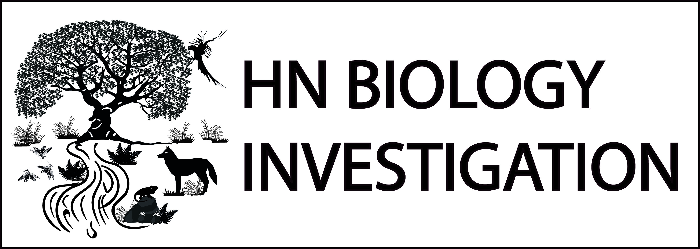

```{r setup, include=FALSE}
knitr::opts_chunk$set(echo = TRUE)
```


Este curso ofrece una introducción completa a los modelos jerárquicos aplicados en ecología, enfocados en el análisis de datos ecológicos complejos. A través de este curso, los participantes aprenderán a utilizar herramientas estadísticas avanzadas para modelar procesos ecológicos que ocurren en múltiples escalas. Se explorarán tanto los aspectos teóricos como prácticos de los modelos jerárquicos, basados en los libros Applied Hierarchical Modelling in Ecology (volúmenes 1 y 2) y Integrating Population Models. Los temas incluyen la modelación de abundancia, ocupación, dinámica de poblaciones y procesos espacio-temporales. El curso está diseñado para ecólogos, conservacionistas y estudiantes interesados en el análisis cuantitativo de datos ecológicos.

### Contenido


[Introduccion al curso](Introduccion.html)

[Clase 1: Introduccion a Modelos Jerarquicos]()

[Clase 2: Modelar abundancia: N-Mixture models](Clase2.html)

[Clase 3: Modelar abundancia con muestreo de distancia jerarquico](Clase3.html)

[Clase 4: Modelar densidad con muestreo de distancia jerarquico](Clase4.html)

[Clase 5: Modelar ocupacion de especies en poblaciones cerradas](Clase5.html)

[Clase 6: Modelar ocupacion con ultiples especies](Clase6.html)

[Clase 7: Modelar abundancia a partir de datos de presencia/ausencia](Clase7.html)

[Clase 8: Modelar supervivencia aparente o persistencia](Clase8.html)

[Clase 9: Modelar supervivencia de nido](Clase9.html)

[Clase 10: Repaso, Preguntas y respuestas](Clase10.html)





